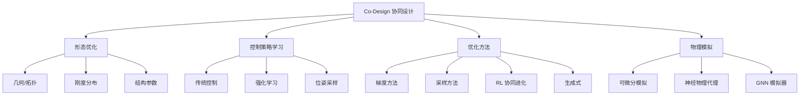

# 主索引 MOC (Map of Content)

> **MOC** (Map of Content) 是 Obsidian 中组织笔记的一种常用方式，它像一张"目录地图"，串联起所有相关的知识节点。

---

## 🎯 本知识库的核心主题

**机器人协同设计 (Robot Co-Design)**：让机器人的 **硬件形态 (morphology / design)** 与 **控制策略 (controller / policy)** 共同演化、协同优化，而不是分步设计。

对应到本论文，就是让 **软体夹爪的刚度分布** 和 **抓取位姿** 一起被优化——这正是 [[00-总览/论文解读 - Co-Design of Soft Gripper|本论文]] 的核心。

---

## 📖 入口文档

- [[论文解读 - Co-Design of Soft Gripper]]
- [[新手学习路径]]
- [[专业术语词典]]

## 🧠 核心概念 (必读)

- [[../01-核心概念/Co-Design 协同设计|Co-Design 协同设计]]
- [[../01-核心概念/软体机器人 Soft Robotics|软体机器人]]
- [[../01-核心概念/神经物理模拟器 Neural Physics|神经物理模拟器]]
- [[../01-核心概念/可微分模拟 Differentiable Simulation|可微分模拟]]
- [[../01-核心概念/腱驱动 Tendon-driven|腱驱动]]
- [[../01-核心概念/柔性铰链 Flexure Joint|柔性铰链]]
- [[../01-核心概念/刚度分布 Stiffness Distribution|刚度分布]]
- [[../01-核心概念/抓取位姿 Grasp Pose|抓取位姿]]
- [[../01-核心概念/Sim-to-Real|Sim-to-Real 转移]]
- [[../01-核心概念/FEM 有限元法|有限元法 FEM]]
- [[../01-核心概念/双层优化 Bi-level Optimization|双层优化]]
- [[../01-核心概念/代理模型 Surrogate Model|代理模型]]

## 🧭 方法流派

- [[../02-方法分类/梯度优化方法|梯度优化方法]]
- [[../02-方法分类/采样优化方法|采样优化方法 (BO, CMA-ES)]]
- [[../02-方法分类/生成式设计|生成式设计]]
- [[../02-方法分类/GNN 图神经网络模拟器|GNN 模拟器]]
- [[../02-方法分类/强化学习协同进化|RL 协同进化]]
- [[../02-方法分类/拓扑优化|拓扑优化]]
- [[../02-方法分类/规划式设计|规划式设计]]

## 📑 参考文献 (50 篇)

- [[../03-参考文献/_参考文献索引|📋 参考文献索引 (按类别)]]

## 🗺️ 研究脉络

- [[../04-研究脉络/Co-Design 研究时间线|时间线：2000 — 2025]]
- [[../04-研究脉络/方法对比总表|方法对比总表]]
- [[../04-研究脉络/关键研究团队与机构|研究团队图谱]]

---

## 📊 知识结构概览

---

*← 返回 [[../README]]*
