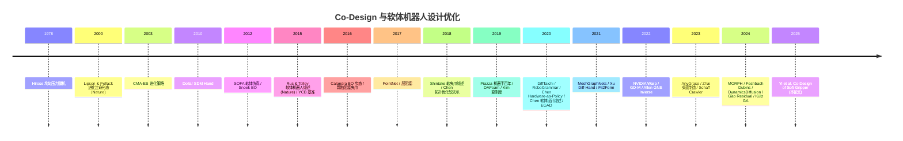

# Co-Design 研究时间线 (2000 — 2025)

> 本页按时间梳理 **机器人协同设计** 和 **软体机器人设计优化** 两条主线的演进，帮助你鸟瞰整个领域的发展。

---

## 🎬 总览

---

## 🌱 第一阶段 (2000-2009)：思想萌芽

### 2000 · Lipson & Pollack
[[../03-参考文献/Ref-03-Lipson-2000-自动设计生命形态]]
> 在 Nature 上首次演示 **形态-控制协同进化 + 自动制造**。奠定 Co-Design 概念。

### 2003 · CMA-ES
[[../03-参考文献/Ref-24-Hansen-2003-CMA-ES]]
> Hansen 确立 CMA-ES，为离散/连续黑盒 co-design 提供算法工具。

### 1978 (追溯) · Hirose 均匀压力
[[../03-参考文献/Ref-42-Hirose-1978-UniformPressure]]
> 硬件设计层面的 "物理智能" 先声——硬件走线本身承担力学智能。

---

## 🏗 第二阶段 (2010-2014)：硬件先行

### 2010 · SDM Hand
[[../03-参考文献/Ref-40-Dollar-2010-SDMhand]]
> 欠驱动 + 柔性关节 + Shape Deposition 制造 → 成为后续软硬混合机器人的模板。

### 2012 · SOFA 框架
[[../03-参考文献/Ref-41-Faure-2012-SOFA]]
> 软体机器人和医学仿真共享的开源框架。

### 2012 · Practical BO
[[../03-参考文献/Ref-23-Snoek-2012-PracticalBO]]
> 贝叶斯优化走向工程化；给机器人学习注入"样本高效"基因。

### 2014 · SDM Hand 系统评估
[[../03-参考文献/Ref-10-Odhner-2014-SDMhand]]
> SDM 家族的代表作，验证欠驱动手的鲁棒性。

---

## 🌊 第三阶段 (2015-2019)：软体浪潮

### 2015 · 软体机器人综述 (Nature)
[[../03-参考文献/Ref-01-Rus-2015-软体机器人综述]]
> 定义软体机器人领域，引发之后 10 年研究浪潮。

### 2015 · YCB 物体集
[[../03-参考文献/Ref-44-Calli-2015-YCB]]
> 操作研究的"ImageNet"；奠定 co-design 的评测基准。

### 2016 · BO 双足步态
[[../03-参考文献/Ref-22-Calandra-2016-BO]]
> BO 首次在 co-design-ish 场景落地。

### 2017 · PointNet
[[../03-参考文献/Ref-47-Qi-2017-PointNet]]
> 开启 3D 深度学习时代——为后续基于点云的神经代理、抓取预测铺路。

### 2018 · 软夹爪综述
[[../03-参考文献/Ref-02-Shintake-2018-软体夹爪综述]]
> 四类机制明确分类，帮助后人定位。

### 2018 · 拓扑优化软夹爪
[[../03-参考文献/Ref-12-Chen-2018-拓扑优化软夹爪]]
> 软夹爪设计首次"被算法决定"。

### 2019 · 机器手百年综述
[[../03-参考文献/Ref-31-Piazza-2019-机器手百年]]
> 历史回顾梳理软/硬、欠驱动/全驱、学习/规则等主要流派。

---

## ⚙️ 第四阶段 (2020-2022)：可微分 & 生成革命

### 2020 · DiffTaichi
[[../03-参考文献/Ref-19-Hu-2020-DiffTaichi]]
> 机器人学界第一次用"可微分编程" 做 co-design。

### 2020 · Hardware as Policy
[[../03-参考文献/Ref-05-Chen-2020-HardwareAsPolicy]]
> 把硬件参数放进 RL 策略参数。

### 2020 · RoboGrammar
[[../03-参考文献/Ref-08-Zhao-2020-RoboGrammar]]
> 图语法 + MCTS 搜索机器人拓扑。

### 2021 · DiffHand (Xu'21)
[[../03-参考文献/Ref-04-Xu-2021-可微设计框架]]
> 端到端可微手部设计；暴露初值敏感性问题。

### 2021 · Fit2Form
[[../03-参考文献/Ref-26-Ha-2021-Fit2Form]]
> 首次用生成模型直接 "画" 夹爪。

### 2021 · MeshGraphNets
[[../03-参考文献/Ref-28-Pfaff-2021-MeshGraphNets]]
> GNN 模拟器一鸣惊人，奠定神经物理模拟器路线。

### 2022 · NVIDIA Warp
[[../03-参考文献/Ref-18-Macklin-2022-Warp]]
> GPU + Python 可微物理工具，成为本论文数据来源。

### 2022 · GD-M / GNS Inverse
[[../03-参考文献/Ref-30-Allen-2022-GDM]]、[[../03-参考文献/Ref-20-Allen-2022-InverseDesignGNS]]
> 神经代理 + 反向设计路线的 DeepMind 工作。

---

## 🚀 第五阶段 (2023-2025)：代理 + 真机时代

### 2023 · AnyGrasp
[[../03-参考文献/Ref-46-Fang-2023-AnyGrasp]]
> 为 co-design 提供标准位姿生成器。

### 2023 · 桌面制造 (Tolley 组)
[[../03-参考文献/Ref-36-Zhai-2023-DesktopFabrication]]
> 让 co-design 具备可制造性闭环。

### 2023 · Schaff 软体爬行 Sim-to-Real
[[../03-参考文献/Ref-06-Schaff-2023-CrawlerSimToReal]]
> RL + DR 把 co-design 首次真机落地。

### 2024 · MORPH
[[../03-参考文献/Ref-07-He-2024-MORPH]]
> 可微硬件代理 + RL = 新范式。

### 2024 · Dynamics-Guided Diffusion
[[../03-参考文献/Ref-27-Xu-2024-DynamicsDiffusion]]
> 扩散模型做机器人设计；生成式再升级。

### 2024 · Residual Physics / Modular GA / Dubins Trees
[[../03-参考文献/Ref-11-Gao-2024-ResidualPhysics]], [[../03-参考文献/Ref-25-Kulz-2024-ModularGA]], [[../03-参考文献/Ref-16-Feshbach-2024-Dubins]]
> 多条支线齐头并进。

### **2025 · 本论文 · Yi et al.**
[[../00-总览/论文解读 - Co-Design of Soft Gripper]]
> **神经代理 + 采样位姿 + 梯度刚度** 联合优化；强调简洁、泛化、真机成功。

---

## 🧭 脉络小结

| 阶段 | 关键词 | 代表 |
|---|---|---|
| 2000-2009 | **思想先驱** | Lipson, CMA-ES |
| 2010-2014 | **硬件原型** | SDM, SOFA |
| 2015-2019 | **软体浪潮** | Rus'15, PointNet, YCB, 软夹爪综述 |
| 2020-2022 | **可微+生成** | DiffTaichi, RoboGrammar, DiffHand, Fit2Form, MeshGraphNets |
| 2023-2025 | **代理+真机** | AnyGrasp, MORPH, DynamicsDiffusion, **本论文** |

---

## 💡 观察与预测

1. **趋势从"手工设计 → 算法设计 → 数据驱动 → 基础模型 + 设计" 演进**。
2. **硬件和控制的边界日渐模糊**——未来可能出现"机器人基础模型" 同时输出形态 + 策略。
3. **Sim-to-Real 仍是瓶颈**；材料/制造的精细建模、残差学习、主动标定将成为焦点。
4. **co-design 可解释性** 是下一个研究热点：为什么优化出"硬指尖软中段"？能否反向启发生物/仿生理论？

---

## 🔗 相关链接

- [[方法对比总表]]
- [[关键研究团队与机构]]
- [[../00-总览/主索引 MOC]]

---

*← 返回 [[../00-总览/主索引 MOC]]*
