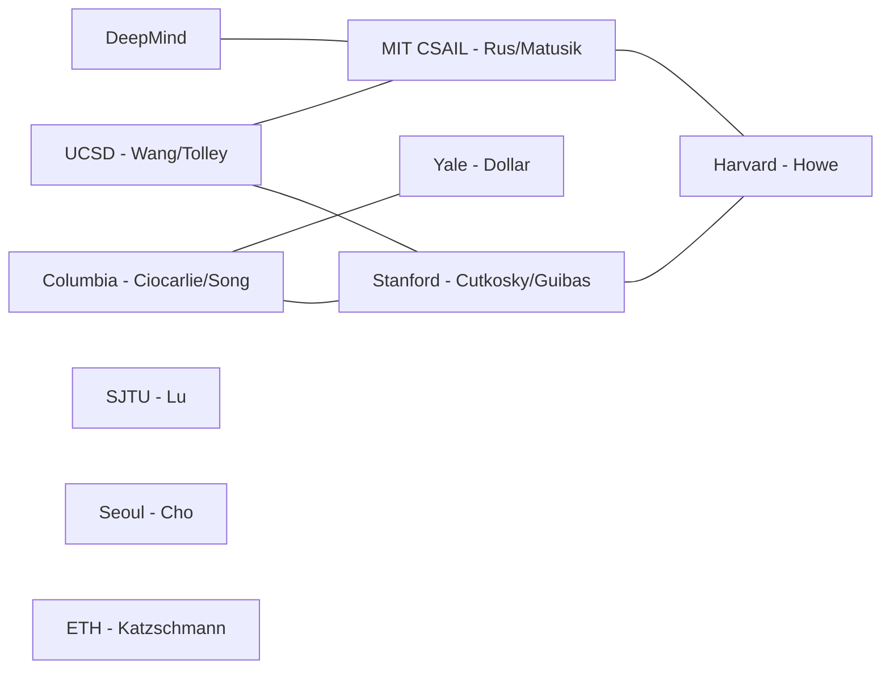

# 关键研究团队与机构

> 本页列出 Co-Design / 软体机器人 / 抓取研究的 **关键团队**，帮助读者按"学派"深入探索。

---

## 🇺🇸 美国

### UCSD — Xiaolong Wang & Michael T. Tolley
- **本论文团队**。
- Wang: 机器学习、神经代理、机器人操纵。
- Tolley: 软体机器人制造、桌面 3D 打印。
- 代表：[[../03-参考文献/Ref-01-Rus-2015-软体机器人综述|Rus 2015]]、[[../03-参考文献/Ref-36-Zhai-2023-DesktopFabrication|Zhai 2023]]、**本论文**。

### MIT CSAIL — Daniela Rus, Wojciech Matusik, Pulkit Agrawal
- 软体机器人 & 可微分 co-design 领衔。
- 代表：[[../03-参考文献/Ref-01-Rus-2015-软体机器人综述|Rus 2015]]、[[../03-参考文献/Ref-04-Xu-2021-可微设计框架|DiffHand]]、[[../03-参考文献/Ref-08-Zhao-2020-RoboGrammar|RoboGrammar]]。

### Columbia — Matei Ciocarlie, Shuran Song
- 机械手 + 生成式设计。
- 代表：[[../03-参考文献/Ref-05-Chen-2020-HardwareAsPolicy|HaaP]]、[[../03-参考文献/Ref-07-He-2024-MORPH|MORPH]]、[[../03-参考文献/Ref-26-Ha-2021-Fit2Form|Fit2Form]]、[[../03-参考文献/Ref-27-Xu-2024-DynamicsDiffusion|DynamicsDiffusion]]。

### Yale — Aaron Dollar
- 欠驱动手 + 夹爪 benchmark。
- 代表：[[../03-参考文献/Ref-10-Odhner-2014-SDMhand|SDM Hand]]、[[../03-参考文献/Ref-09-Bircher-2021-CageHand|Bircher'21]]、[[../03-参考文献/Ref-44-Calli-2015-YCB|YCB]]。

### Harvard — Robert Howe, Robert Wood, George Whitesides
- 软体硬件 & Jamming 技术。
- 代表：[[../03-参考文献/Ref-33-Rothemund-2018-BistableValve|双稳态阀]]、[[../03-参考文献/Ref-38-Narang-2017-LaminarJamming|层阻塞]]。

### Stanford — Mark Cutkosky, Leonidas Guibas
- SDM、壁虎粘附、PointNet。
- 代表：[[../03-参考文献/Ref-43-Glick-2018-GeckoGripper|Glick'18]]、[[../03-参考文献/Ref-47-Qi-2017-PointNet|PointNet]]。

### TTIC / UChicago — Matthew Walter, Charles Schaff
- 软体机器人 RL & Sim-to-Real。
- 代表：[[../03-参考文献/Ref-06-Schaff-2023-CrawlerSimToReal|Schaff 2023]]。

---

## 🇨🇳 中国 / 亚洲

### 上海交大 Cewu Lu 团队
- AnyGrasp 之家。
- 代表：[[../03-参考文献/Ref-46-Fang-2023-AnyGrasp|AnyGrasp]]。

### 南方科技大学 / 港科大 — Michael Y. Wang
- 拓扑优化软夹爪。
- 代表：[[../03-参考文献/Ref-12-Chen-2018-拓扑优化软夹爪|Chen 2018]]、[[../03-参考文献/Ref-13-Chen-2020-软体设计综述|Chen 2020 综述]]。

### 首尔大学 — Kyu-Jin Cho
- 连续变刚度机构。
- 代表：[[../03-参考文献/Ref-37-Kim-2019-VariableStiffness|Kim'19]]。

### 东京工业大学 — Shigeo Hirose
- 机器人机构学开山。
- 代表：[[../03-参考文献/Ref-42-Hirose-1978-UniformPressure|均匀压力软夹爪 1978]]。

---

## 🇪🇺 欧洲

### EPFL Floreano Lab
- 软体机器人学与进化机器人。
- 代表：[[../03-参考文献/Ref-02-Shintake-2018-软体夹爪综述|Shintake 综述]]。

### TUM — Matthias Althoff
- 模块化机器人优化。
- 代表：[[../03-参考文献/Ref-25-Kulz-2024-ModularGA|Külz 2024]]。

### ETH Zürich — Robert Katzschmann
- 软体机器人残差物理。
- 代表：[[../03-参考文献/Ref-11-Gao-2024-ResidualPhysics|Gao 2024]]。

### Inria — Christian Duriez
- SOFA 框架的核心团队。
- 代表：[[../03-参考文献/Ref-41-Faure-2012-SOFA|SOFA]]。

### Pisa / IIT — Antonio Bicchi
- 机器手百年史 + Pisa/IIT SoftHand。
- 代表：[[../03-参考文献/Ref-31-Piazza-2019-机器手百年]]。

---

## 🏢 工业界 & 研究院

### NVIDIA — Matthias Macklin (Warp)
- [[../03-参考文献/Ref-18-Macklin-2022-Warp|NVIDIA Warp]] —— 本论文数据生成工具。

### DeepMind
- GNS / MeshGraphNets / GD-M 路线。
- 代表：[[../03-参考文献/Ref-28-Pfaff-2021-MeshGraphNets|MGN]]、[[../03-参考文献/Ref-20-Allen-2022-InverseDesignGNS|GNS Inverse]]、[[../03-参考文献/Ref-30-Allen-2022-GDM|GD-M]]。

### Hod Lipson Lab (Columbia / Cornell)
- Co-design 开山。
- 代表：[[../03-参考文献/Ref-03-Lipson-2000-自动设计生命形态|Lipson 2000]]。

---

## 🕸 合作网络速览

---

*← 返回 [[../00-总览/主索引 MOC]]*
